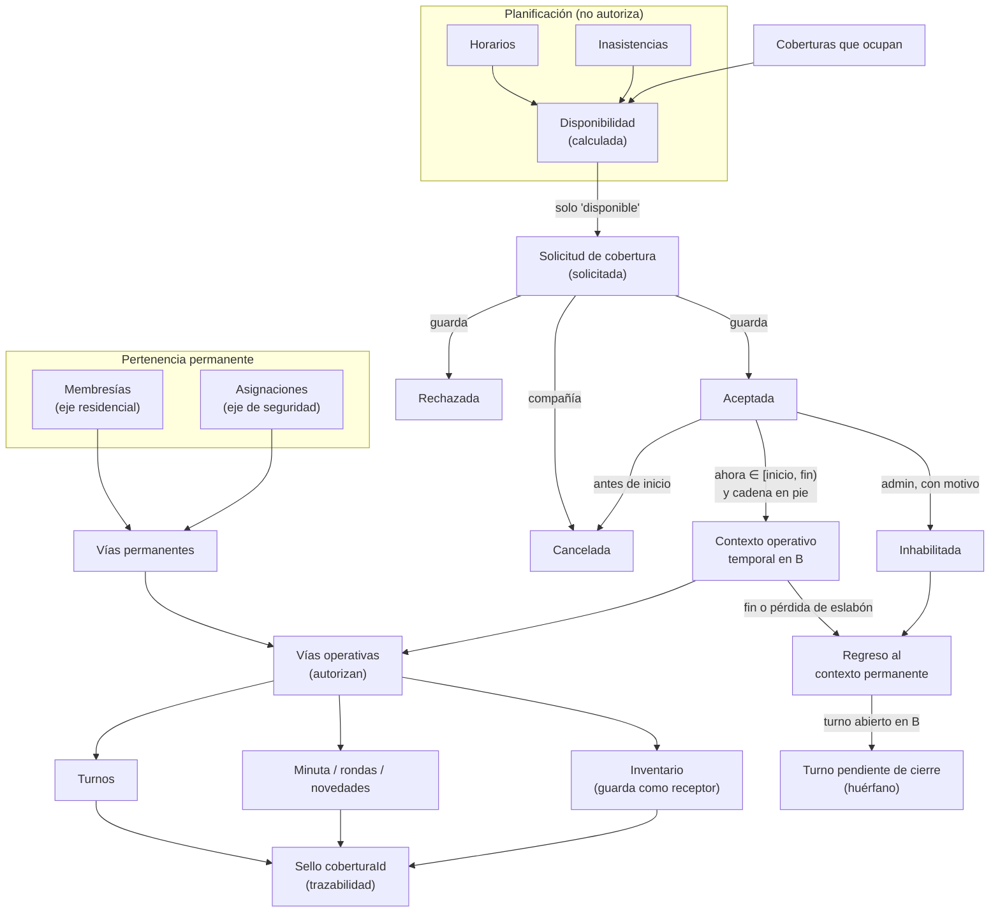
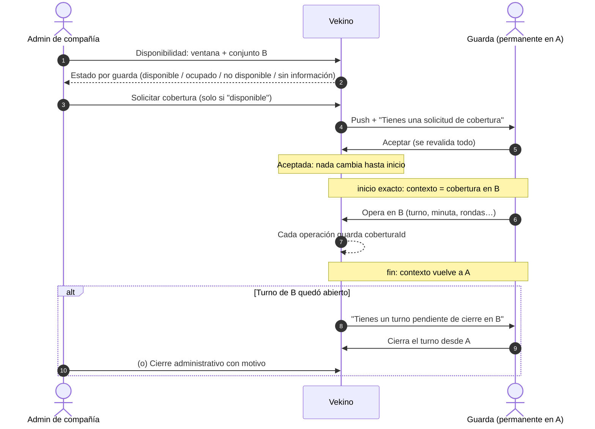
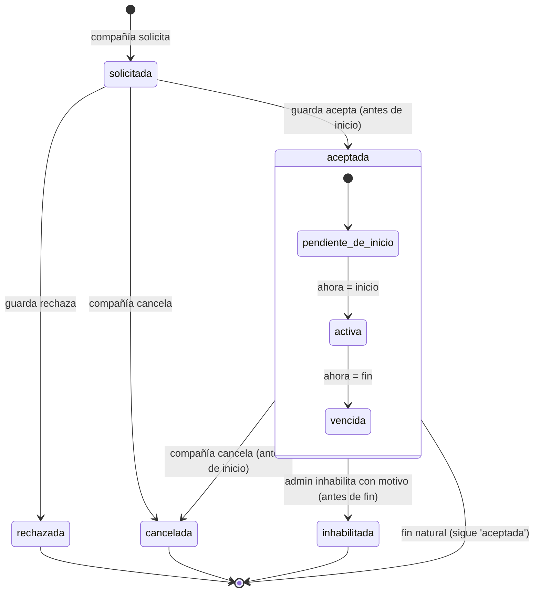
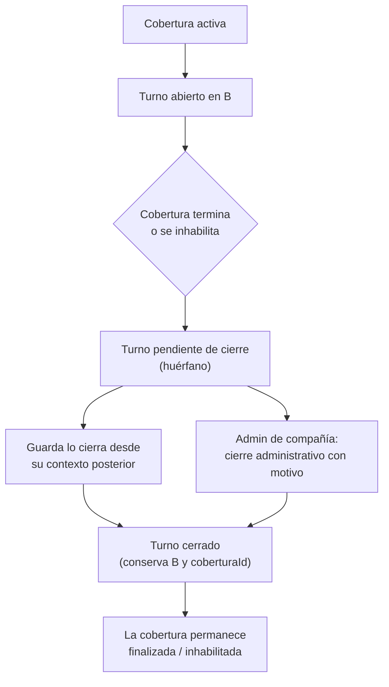

# Guardas, planificación y coberturas temporales

Documentación funcional y técnica del módulo de gestión de guardas de compañías de vigilancia en Vekino: planificación (horarios e inasistencias), disponibilidad, coberturas temporales, contexto operativo, turnos, inventario y trazabilidad.

| | |
|---|---|
| **Estado documentado** | Hasta la Fase 16 (re-test QA manual, 6 de octubre de 2026) |
| **Código de referencia** | `804503c` (Fase 15 commiteada) |
| **Fuera del estado validado** | Cambios sin commit posteriores a la Fase 16 en `apps/web/components/dashboard-shell.tsx`, `packages/backend/pruebas/correccionesPostQa.test.ts` y `apps/web/pruebas/navegacionCompania.test.mjs` (ver [§18](#18-estado-actual-del-proyecto)) |

**Convenciones de este documento**

- ✅ **Implementado**: existe en el código y está cubierto por pruebas o QA.
- ⏳ **Pendiente**: defecto o trabajo abierto.
- 🔎 **Observación**: comportamiento detectado que no se registró como defecto.
- 🚫 **Fuera de alcance**: excluido explícitamente de esta línea de trabajo.

---

## Contenido

1. [Objetivo del documento](#1-objetivo-del-documento)
2. [Resumen ejecutivo](#2-resumen-ejecutivo)
3. [Arquitectura funcional general](#3-arquitectura-funcional-general)
4. [Flujo completo de uso](#4-flujo-completo-de-uso)
5. [Reglas de negocio fundamentales](#5-reglas-de-negocio-fundamentales)
6. [Features implementadas](#6-features-implementadas)
7. [Disponibilidad](#7-disponibilidad)
8. [Inasistencias](#8-inasistencias)
9. [Horarios](#9-horarios)
10. [Coberturas temporales](#10-coberturas-temporales)
11. [Contexto operativo](#11-contexto-operativo)
12. [Turnos y turnos huérfanos](#12-turnos-y-turnos-huérfanos)
13. [Inventario](#13-inventario)
14. [Trazabilidad histórica](#14-trazabilidad-histórica)
15. [Autorización y seguridad](#15-autorización-y-seguridad)
16. [Experiencia por tipo de usuario](#16-experiencia-por-tipo-de-usuario)
17. [Correcciones de la Fase 15](#17-correcciones-de-la-fase-15)
18. [Estado actual del proyecto](#18-estado-actual-del-proyecto)
19. [Guía rápida de uso](#19-guía-rápida-de-uso)
20. [Limitaciones y decisiones de diseño](#20-limitaciones-y-decisiones-de-diseño)
21. [Estado para la siguiente fase](#21-estado-para-la-siguiente-fase)

---

## 1. Objetivo del documento

Explicar de extremo a extremo qué existe hoy en el módulo, para qué sirve, cómo se usa y cómo se relacionan sus piezas, de modo que un desarrollador, un QA o un responsable funcional pueda trabajar con él sin haberlo implementado.

Cubre las funcionalidades, las reglas de negocio, lo que ocurre antes, durante y después de una cobertura, qué afecta a la disponibilidad y a la autorización, qué queda guardado en el histórico, qué validaciones existen y qué queda pendiente.

---

## 2. Resumen ejecutivo

**Qué se construyó.** Un módulo para que las compañías de vigilancia planifiquen a sus guardas y cubran temporalmente conjuntos con personal de otros conjuntos, sin perder el control de quién opera dónde ni el rastro de lo que se hizo.

**Problema operativo que resuelve.** Cuando un conjunto se queda sin guarda (vacaciones, incapacidad, ausencia), la compañía necesita saber quién puede cubrirlo, pedírselo, y que durante esa ventana el guarda opere en el conjunto destino con los permisos correctos, volviendo después a su puesto habitual.

**Cómo encajan las piezas.**

- **Horarios**: dónde y cuándo debería trabajar cada guarda.
- **Inasistencias**: cuándo no está disponible y por qué.
- **Disponibilidad**: combina horarios, inasistencias y coberturas para responder si un guarda puede cubrir una ventana completa. No autoriza nada.
- **Coberturas**: la compañía pide, el guarda acepta o rechaza. Una cobertura aceptada no cambia nada hasta su `inicio`.
- **Contexto operativo**: mientras una cobertura aceptada está activa y su cadena sigue válida, el guarda opera como guarda solo en el conjunto destino.
- **Turnos, minuta, rondas, novedades e inventario**: lo que se registra durante la cobertura queda sellado con su `coberturaId`.

> **Concepto central.** Una cobertura temporal **no reemplaza ni modifica** las asignaciones permanentes del guarda. Crea un **contexto operativo temporal** que prevalece únicamente durante su vigencia. Ese contexto no se guarda en ninguna tabla: se deriva en cada lectura.

---

## 3. Arquitectura funcional general



Vista simplificada:

```text
Asignaciones permanentes ─┬─ Horarios ──────┐
                          ├─ Inasistencias ─┼──► Disponibilidad (calculada)
                          └─ Coberturas ────┘            │ solo "disponible"
                                                         ▼
                                              Solicitud de cobertura
                                                 ┌───────┴────────┐
                                                 ▼                ▼
                                            Rechazada          Aceptada ── Cancelada (antes de inicio)
                                                                  │
                                                     inicio exacto + cadena en pie
                                                                  ▼
                                                   Contexto operativo temporal B
                                                    ┌─────────────┼─────────────┐
                                                    ▼             ▼             ▼
                                                  Turnos   Minuta/rondas   Inventario
                                                    └────── sello coberturaId ──┘
                                                                  │
                                          fin natural / inhabilitación / eslabón roto
                                                                  ▼
                                                 Regreso al contexto permanente
                                                 (turno abierto en B → pendiente de cierre)
```

Relaciones que el código añade al diagrama base:

- La disponibilidad **también** lee las coberturas que ya ocupan al guarda, en cualquier compañía.
- El acceso no lo da la cobertura aceptada sola: la da la cobertura **activa que además pasa su cadena** (contrato, compañía, guarda y conjunto).
- La inhabilitación y la ruptura de un eslabón (contrato terminado, compañía suspendida, guarda dado de baja, conjunto inactivo) devuelven al guarda a su contexto permanente sin tocar ninguna fila.

---

## 4. Flujo completo de uso

### Escenario

Un guarda pertenece permanentemente al conjunto **A**. Durante unas horas debe cubrir el conjunto **B**, de la misma compañía.

### Flujo principal



1. **Consulta de disponibilidad.** La compañía elige ventana y conjunto destino en la pestaña Disponibilidad.
2. **Verificación.** Solo los guardas en estado `disponible` tienen el botón “Solicitar cobertura”. El servidor vuelve a comprobarlo al crear la solicitud.
3. **Solicitud.** Se crea la cobertura en estado `solicitada`, ligada al contrato del conjunto destino, y se envía un aviso push al guarda.
4. **Recepción.** El guarda ve la solicitud en su portería, en su inicio (`/dashboard`) o en su portal de residente, según lo que tenga.
5. **Respuesta.** El guarda acepta o rechaza. Al aceptar, el servidor revalida disponibilidad, contrato, pertenencia y compañía.
6. **Espera.** Una cobertura aceptada no cambia nada hasta `inicio`: el guarda sigue operando en A.
7. **Activación.** En el instante `inicio` (sin tolerancia) la cobertura pasa a estar **activa**. No es un estado guardado: se deriva.
8. **Cambio de contexto.** El guarda opera como guarda solo en B. La web lo lleva a la portería de B por sí sola.
9. **Suspensión en A.** Sus vías de guarda en A (asignación de guarda y rol `guardia` de una membresía) quedan suspendidas. Si además es residente o administrador en algún conjunto, eso no se toca.
10. **Operación en B.** Puede iniciar y cerrar turnos, registrar minuta, rondas, novedades y recibir material.
11. **Sello.** Cada operación creada durante la cobertura guarda su `coberturaId`.
12. **Fin.** En `fin` el contexto vuelve a A automáticamente.
13. **Turno abierto.** Si al terminar seguía abierto un turno suyo en B, queda **pendiente de cierre** (turno huérfano).
14. **Recuperación.** El guarda lo cierra desde su contexto posterior, o el administrador de la compañía lo cierra administrativamente con motivo.
15. **Asignaciones intactas.** En ningún momento se modifican la asignación permanente, la membresía, el contrato ni los horarios.

### Escenarios alternativos

| Escenario | Qué ocurre |
|---|---|
| **Cobertura rechazada** | Queda `rechazada` en el historial. No se puede volver a aceptar; si hace falta, se crea otra. |
| **Cobertura cancelada** | La compañía puede cancelar una `solicitada` o una `aceptada` que todavía no empezó. Una vez empezada ya no se cancela: se inhabilita. |
| **Cobertura inhabilitada** | Solo el administrador de la compañía o la plataforma, con motivo (máx. 500 caracteres), sobre una aceptada que no terminó. Corta el contexto en ese instante; la ventana pactada se conserva y el corte queda en `inhabilitadaEn`. |
| **Fin natural** | Al llegar `fin` el contexto vuelve solo al permanente. El estado guardado sigue siendo `aceptada`. |
| **Termina con turno abierto** | El turno queda pendiente de cierre. Ver [§12](#12-turnos-y-turnos-huérfanos). |
| **Cobertura superpuesta** | No se puede crear ni aceptar una cobertura que se cruce con otra aceptada del mismo guarda (en cualquier compañía). Si por un dato inconsistente hubiera dos activas a la vez, el contexto queda **bloqueado** y el guarda no opera como guarda en ninguna parte. |
| **Cadena rota** | Si el contrato termina, la compañía se suspende, el guarda es dado de baja o el conjunto se desactiva, la cobertura deja de dar acceso en ese instante. Tampoco ocupa disponibilidad ni bloquea inasistencias. |
| **Operar fuera del conjunto temporal** | Durante la cobertura, las porterías de A (o de cualquier otro conjunto) no le abren como guarda. Única excepción: cerrar un turno de su conjunto permanente que **ya estaba abierto** antes de que empezara la cobertura. |

---

## 5. Reglas de negocio fundamentales

| # | Regla | Dónde vive |
|---|---|---|
| 1 | Las coberturas son temporales y son un registro propio, no una asignación. | `lib/coberturas.ts` |
| 2 | La ventana de una cobertura dura como máximo **31 días** (`MAX_DIAS_VENTANA`). | `lib/disponibilidad.ts` |
| 3 | Las ventanas son semiabiertas: **`[inicio, fin)`**. | `estaActiva`, `lib/inasistencias.ts` |
| 4 | Inicio y fin se evalúan con tiempo exacto, sin tolerancia. Una cobertura nueva no puede empezar en el pasado. | `exigirInicioFuturo` |
| 5 | “Activa” no es un estado guardado: es `aceptada` y `ahora ∈ [inicio, fin)`. | `estaActiva` |
| 6 | Una cobertura activa que pasa su cadena prevalece sobre el contexto permanente del guarda. | `coberturaActivaDeGuardia` |
| 7 | Durante una cobertura activa, el destino es el único contexto válido para operaciones de guardia. | `aplicarContexto` |
| 8 | Las asignaciones, membresías, contratos y horarios no se modifican por una cobertura. | `coberturas.ts` |
| 9 | No se persiste ningún `conjuntoOperativoId`: el contexto se deriva en cada lectura. | `resolverContextoOperativoGuardia` |
| 10 | Solo un guarda en estado `disponible` es elegible. `desconocido` (sin horario) **nunca** es elegible. | `exigirElegible` |
| 11 | El supervisor no es elegible para cubrir: solo quien en su compañía tiene el rol `guardia`. | `exigirGuardaActivo` |
| 12 | Un guarda que ya pertenece al conjunto destino (por membresía o asignación) no necesita cobertura y no se le puede pedir. | `exigirElegible` |
| 13 | El contrato del destino debe cubrir **toda** la ventana. | `exigirElegible` |
| 14 | Las coberturas aceptadas cuentan como ocupación en la disponibilidad; las inhabilitadas, hasta su corte. | `coberturasQueOcupan` |
| 15 | Dos coberturas activas simultáneas bloquean el contexto de guardia (`bloqueado`). | `resolverContextoOperativoGuardia` |
| 16 | Los roles no relacionados con guardia (residente, administración, supervisor) no se pierden durante una cobertura. | `aplicarContexto` |
| 17 | Una inasistencia que se solape con una cobertura aceptada **con la cadena en pie** se rechaza. Hay que inhabilitar antes la cobertura (si es de la propia compañía). | `inasistencias.crear` |
| 18 | Una cobertura con la cadena rota o inhabilitada no bloquea inasistencias ni ocupa disponibilidad más allá de su corte. | `cadenaEnPie` |
| 19 | Las operaciones históricas conservan el `coberturaId` con el que se crearon; nunca se recalcula. | `coberturaQueAmpara` |
| 20 | Se revalida todo al aceptar: lo que la pantalla viera al solicitar no cuenta. | `aceptar` |
| 21 | Nada vuelve atrás: una rechazada no se acepta, una inhabilitada no se rehabilita. | `lib/coberturas.ts` |

---

## 6. Features implementadas

### Fase 1 — Auditoría inicial
Análisis del modelo de acceso y vigilancia existente que sirvió de base para el plan. Sin cambios en el repositorio.

### Fase 2 — Normalización de autorización (`93c7dc2`)
Introduce las **vías de acceso** (`model/vias.ts`): membresía y asignación como formas de pertenencia a un conjunto, con un solo criterio cada una y un solo punto de consulta.

### Fase 3 — Hardening de autorización (`6cebce4`)
El conjunto activo pasa a ser el quinto eslabón de la cadena de asignación. Los compañeros de turno de una portería salen de las vías de guarda reales del conjunto.

### Fase 4 — Inasistencias (`3c1705e`)
Registro, consulta y anulación de ausencias por tipo y ventana. Es información de planificación: no toca permisos.

### Fase 5 — Horarios (`b935bbf`)
Horario semanal por bloques con vigencia, por conjunto o general, con cruces de medianoche, finalización e historial.

### Fase 6 — Disponibilidad (`0124496`)
Calcula si un guarda puede cubrir una ventana completa a partir de horarios e inasistencias: `disponible`, `ocupado`, `no_disponible` o `desconocido`.

### Fase 7 — Coberturas: solicitudes y ciclo de vida (`635b3d6`)
Solicitar, aceptar, rechazar, cancelar e inhabilitar coberturas, con revalidación al aceptar y aviso push al guarda.

### Fase 8 — Contexto operativo (`70515d9`)
La cobertura activa con su cadena en pie se convierte en vía de guarda en el destino y suspende las vías de guarda permanentes. Incluye la excepción de cierre del turno previo.

### Fase 9 — Soporte móvil (`04cefa5`)
La app móvil sigue el contexto operativo: selección de conjunto, refresco al cambiar de contexto, solicitudes, turno pendiente y estados “sin portería” y “bloqueado”.

### Fase 10 — Inventario contextual (`3c6ba87`)
La entrega de material a un guarda depende de que hoy opere en esa portería. Los pendientes de custodia reflejan el contexto.

### Fase 11 — Trazabilidad histórica (`cad253a`)
Turnos, rondas, minuta, novedades y custodias guardan el `coberturaId` vigente al crearse. Las lecturas y el historial lo muestran.

### Fase 12 — Auditoría integral
Revisión completa del módulo sin cambios en el repositorio. Dejó la lista de correcciones previas al QA.

### Fase 13 — Correcciones integradas de auditoría (`52f508a`)
Inasistencia bloqueada por cobertura aceptada, disponibilidad masiva igual a la individual, causa del pendiente de custodia, textos y avisos de privacidad.

### Fase 14 — QA manual integral
Prueba en navegador real sobre un backend local. Encontró 8 defectos (QA-001 a QA-008), uno crítico.

### Fase 15 — Correcciones post-QA (`804503c`)
Corrige los 8 defectos: protección de cuentas existentes, turnos huérfanos, rutas, mensajes de error y superficies de solicitudes.

### Fase 16 — Re-test QA manual
Revalidación en navegador: 7 de 8 resueltos, QA-004 abierto y un defecto nuevo de severidad baja (QA-NEW-001).

---

## 7. Disponibilidad

> La disponibilidad responde: *“¿qué sabemos hoy sobre si este guarda puede cubrir **completa** esta ventana?”*. Es calculada, nunca guardada, y **no es una regla de autorización**: no bloquea ni habilita el acceso a nada.

### Estados

Ordenados de más a menos fuerte (el primero que aplica gana):

| Estado | Etiqueta en pantalla | Cuándo |
|---|---|---|
| `no_disponible` | No disponible | Alguna inasistencia **activa** se cruza con la ventana. |
| `ocupado` | Ocupado | Algún bloque de algún horario (de cualquier conjunto o general) se cruza con la ventana, o alguna cobertura que ya lo ocupa. |
| `disponible` | Disponible | Todos los días que toca la ventana tienen algún horario vigente y ninguno la ocupa. |
| `desconocido` | Sin información | Algún día de la ventana no tiene ningún horario que rija. |

### Cómo intervienen las fuentes

- **Horarios**: un bloque de trabajo que se cruza con la ventana significa que el guarda está **planificado para trabajar** en ese momento → `ocupado`. Un día sin bloques dentro de un horario vigente es libre según la planificación.
- **Inasistencias**: solo las `activas`. Las anuladas no cuentan.
- **Coberturas**: las aceptadas con la cadena en pie la ocupan entera; las inhabilitadas, hasta su corte. Se miran **todas las compañías**: la compañía que pregunta decide a qué guardas alcanza, no qué compromisos del guarda existen.
- Asignaciones, contratos y turnos **no participan**.

Cuando manda una inasistencia, los choques de horario y cobertura se siguen listando como motivos adicionales.

### Consulta individual y masiva

| Consulta | Función | Uso |
|---|---|---|
| Individual | `disponibilidad.deGuarda` | Un guarda y una ventana. |
| Masiva | `disponibilidad.deGuardasEnAlcance` | Todos los guardas al alcance de quien pregunta; es la tabla de la pestaña Disponibilidad. |

Ambas evalúan con la misma función (`evaluarDisponibilidadDe`) y la misma carga de coberturas, así que **siempre coinciden**. Lo verifican pruebas automáticas y el QA (0 diferencias en 3 roles × 6 ventanas en la Fase 16).

La disponibilidad devuelve la **categoría** de la inasistencia, nunca su motivo escrito.

### “Sin información” no es “libre”

Si un guarda no tiene horario para algún día de la ventana, el estado es `desconocido` y **no se le puede pedir una cobertura**. No saber no es estar libre.

### Ejemplos

```text
Jason: horario A, lunes a domingo 06:00–18:00
  Ventana hoy 15:20–16:30  → ocupado      (su bloque de A cubre esa franja)
  Ventana hoy 19:00–21:00  → disponible   (el horario rige y no tiene bloque)

Carlos: incapacidad activa del 06/10 al 07/10
  Cualquier ventana en esas fechas → no_disponible

Nicolás: sin horario registrado
  Cualquier ventana → desconocido (no elegible)

Ernesto: cobertura de otra compañía con la cadena rota (lo dieron de baja allí)
  Ventana dentro de esa cobertura → no la cuenta como ocupación
```

---

## 8. Inasistencias

> Una inasistencia dice: *“durante esta ventana este guarda no está disponible para planificar, y por qué”*. **Es información de planificación. No sustituye ni modifica permisos ni autorizaciones.** Un guarda incapacitado puede seguir entrando a su portería y cerrar el turno que tenga abierto.

### Tipos

| Tipo | Motivo |
|---|---|
| `inasistencia` | **Obligatorio** |
| `incapacidad` | Opcional (con aviso de datos sensibles) |
| `vacaciones` | Opcional |
| `permiso` | Opcional |
| `otro` | **Obligatorio** |

El día libre no es un tipo a propósito: es planificación normal y pertenece al horario. El motivo admite hasta 500 caracteres.

### Ventana

- **Días completos** (fechas civiles) o **con hora** (instantes), siempre en hora de Colombia y con ventana `[inicio, fin)`.
- Un guarda no puede tener dos inasistencias activas que se crucen.

### Estados

| Estado | Significado |
|---|---|
| `activa` | Cuenta como indisponibilidad. |
| `anulada` | No cuenta. No se borra: conserva quién la anuló y cuándo. Repetir la anulación no reescribe esos datos. |

### Interacción con coberturas

- Si la ventana se solapa con una cobertura **aceptada con la cadena en pie**, el registro se rechaza:
  - si la cobertura es de la **misma compañía**: *“Inhabilita primero la cobertura o registra la inasistencia para otro periodo.”*;
  - si es de **otra compañía**: *“Esa compañía debe inhabilitarla antes…”*. Nunca se pide inhabilitar lo que no se puede gestionar.
- Una cobertura con la cadena rota o ya inhabilitada **no bloquea**.
- Una inasistencia activa hace que el guarda quede `no_disponible` y, por tanto, no elegible para nuevas coberturas.

### Quién puede

Capacidad `seguridad.inasistencias`, con el alcance de planificación (`model/alcanceGuarda.ts`):

- plataforma y administrador de compañía: todos los guardas de la compañía;
- supervisor: los guardas que **hoy** trabajan en alguno de los conjuntos que supervisa;
- guarda: nada (no ve ni registra inasistencias).

### Consulta y anulación

- Por guarda (activas e historial) y por compañía en un rango de fechas.
- La anulación libera la disponibilidad desde ese momento.

### Información sensible

- Al registrar una incapacidad el formulario muestra: *“No incluyas diagnósticos, historias clínicas ni información médica sensible.”*
- El motivo escrito solo se muestra en el módulo de inasistencias a quien tiene alcance sobre el guarda; la disponibilidad expone únicamente la categoría.

---

## 9. Horarios

> El horario es **planificación**: dice dónde y cuándo debería estar trabajando un guarda. No autoriza ni desautoriza nada. Si un guarda trabaja fuera de lo planificado, el sistema no lo bloquea.

### Modelo

- **Patrón semanal por bloques**: `{ dia: 0=domingo … 6=sábado, horaInicio, horaFin }` en formato `HH:MM`. Hasta 21 bloques (tres por día). Los días sin bloques son los libres.
- **Contexto**: un horario puede ser de un **conjunto** (con contrato de la compañía) o **general** (sin conjunto).
- **Vigencia**: `fechaInicio` obligatoria y `fechaFin` opcional (vacío = indefinido; el último día cuenta entero). Fechas civiles en hora de Colombia.
- **Cruce de medianoche**: un bloque `22:00–06:00` termina al día siguiente; se muestra con `(+1)`. Dos bloques del mismo horario no pueden pisarse, incluidos los que cruzan la medianoche.

### Choques entre horarios

Dos horarios del mismo guarda **en el mismo contexto** (mismo conjunto, o ambos generales) no pueden planificarlo en el mismo momento. Se comparan fechas reales, no solo la semana tipo. Horarios de contextos distintos sí pueden coexistir.

### Estados, finalización e historial

- Estado derivado de la vigencia: programado, vigente o terminado.
- **Finalizar** fija el último día en que rige: no puede ser anterior a ayer (lo ya planificado no se reescribe) ni alargar el horario.
- Para cambiar la planificación se finaliza el horario y se registra otro. El historial del guarda conserva todos.

### Relación con disponibilidad

Los horarios determinan si un guarda está `ocupado` (tiene bloque en la ventana), `disponible` (rige un horario y no tiene bloque) o `desconocido` (algún día sin horario).

> **No tener horario registrado no significa automáticamente estar disponible.** Significa que no hay información, y eso impide pedirle una cobertura.

### Quién puede

Capacidad `seguridad.horarios`, con el mismo alcance que las inasistencias. El guarda no gestiona su horario.

---

## 10. Coberturas temporales

### Ciclo de vida



| Estado guardado | Etiqueta | Notas |
|---|---|---|
| `solicitada` | Pendiente | Esperando respuesta del guarda. |
| `aceptada` | Aceptada | Compromiso confirmado. Su fase (pendiente de inicio, activa, vencida) se **deriva** del reloj. |
| `rechazada` | Rechazada | Terminal. |
| `cancelada` | Cancelada | Terminal. Solo antes de que empiece. |
| `inhabilitada` | Inhabilitada | Terminal. Corte manual con motivo; guarda `inhabilitadaEn`. |

“Activa” y “vencida” no se guardan: una cobertura que termina por su `fin` sigue en estado `aceptada`.

### Quién puede hacer qué

| Acción | Quién | Regla |
|---|---|---|
| Solicitar | Quien puede asignar personal al conjunto destino (`seguridad.asignar`) **y** alcanza al guarda con el alcance de la disponibilidad. | Administrador de compañía o plataforma. Un supervisor, solo si supervisa el destino y el guarda trabaja en uno de sus conjuntos. |
| Aceptar / rechazar | **Solo el guarda destinatario.** | Aceptar solo antes de `inicio`. |
| Cancelar | Quien tiene `seguridad.asignar` sobre el destino. | Solicitada, o aceptada que no empezó. |
| Inhabilitar | **Solo administrador de compañía o plataforma.** El supervisor no. | Aceptada que no terminó, con motivo de 1 a 500 caracteres. |
| Ver | El guarda, las suyas; quien gestiona el destino, las de su alcance. | El supervisor ve las de los conjuntos que supervisa. |

### Validaciones al solicitar y otra vez al aceptar

1. La compañía está activa.
2. La persona es guarda de alta en la compañía (*“Solo un guarda de la compañía puede cubrir.”*).
3. El contrato con el destino cubre **toda** la ventana.
4. El conjunto destino está activo.
5. El guarda no pertenece ya al destino, ni por membresía ni por asignación.
6. Disponibilidad `disponible`. En otro caso, error específico:
   - `no_disponible`: *“El guarda tiene una inasistencia en esa ventana: no puede cubrirla.”*;
   - `ocupado` por cobertura: *“El guarda ya tiene una cobertura aceptada que se cruza con esa ventana.”*;
   - `ocupado` por horario: *“El guarda está ocupado según su horario en esa ventana.”*;
   - `desconocido`: *“No hay horario registrado del guarda para toda la ventana…”*.
7. Al solicitar, además: inicio en el futuro y duración máxima de 31 días.

### Alcance por compañía y entre conjuntos

- La cobertura se liga al **contrato** de la compañía con el conjunto destino; el conjunto sale del contrato y se guarda tal cual.
- Un guarda solo puede estar activo en una compañía a la vez (*“Esa persona ya es personal activo de otra compañía. Debe darse de baja allí primero.”*).
- Por eso una cobertura de **otra compañía** solo puede afectar a un guarda que ya salió de ella: su cadena está rota, no da acceso, no ocupa disponibilidad y no bloquea inasistencias.

### Cuando la cadena deja de ser válida

La cadena de la cobertura tiene cinco eslabones, los mismos que la asignación:

```text
1. aceptada y ahora ∈ [inicio, fin)
2. contrato del mismo par compañía–conjunto y vigente
3. compañía activa
4. guarda de alta en esa compañía, como guarda
5. conjunto activo
```

Si cae cualquiera, la cobertura deja de ser vía **en ese instante, al leer**. Ninguna fila se modifica; el guarda vuelve a sus vías permanentes sin intervención.

### Qué se permite durante la cobertura

- Operar como guarda en el destino: turnos, minuta, rondas, novedades, aportes y lo demás que permita su rol de guarda (`porteria.operar`, `porteria.ver`, incidentes).
- Recibir material en custodia en el destino.
- Seguir usando sus roles no relacionados con guardia en cualquier conjunto.
- Cerrar el turno de su conjunto permanente que ya estaba abierto al empezar la cobertura.

---

## 11. Contexto operativo

### Contexto permanente

Dónde trabaja normalmente el guarda: sus **vías permanentes**.

- **Membresía** (eje residencial): la fila activa en un conjunto, con sus roles.
- **Asignación** (eje de seguridad): guarda o supervisor de una compañía con contrato vigente, que pasa los cinco eslabones.

### Contexto temporal

Dónde está autorizado a operar como guarda por una **cobertura activa** con la cadena en pie.

### Los tres valores del contexto

| Tipo | Significado |
|---|---|
| `permanente` | Sin cobertura activa: sus vías de siempre, sin cambios. |
| `cobertura` | Opera como guarda **solo** en el conjunto de la cobertura. |
| `bloqueado` | Más de una cobertura activa a la vez (dato inconsistente). No opera como guarda en ninguna parte hasta que se corrija. |

### Ejemplo

```text
Antes:    Guarda → A        (contexto permanente)
Durante:  Guarda → B        (contexto cobertura; A suspendido para guardia)
Después:  Guarda → A        (contexto permanente)
```

### Cómo se aplica

Con contexto `cobertura` (o `bloqueado`):

- la asignación con rol `guardia` se suspende;
- la membresía pierde el rol `guardia` y conserva los demás; si no tenía otro, se suspende entera;
- residente, administración y supervisor no cambian;
- en el conjunto de la cobertura, la cobertura se suma como vía de guarda.

> **Durante una cobertura activa, el destino de cobertura es el único contexto operativo válido para operaciones de guardia.**

### Derivado, nunca persistido

No existe un `conjuntoOperativoId` en ninguna tabla. El contexto se calcula en cada petición con su propio instante (`resolverContextoOperativoGuardia`) y se aplica sobre las vías permanentes (`aplicarContexto`). Quien autoriza (`resolverAcceso`, `requireCondominioRole`) pregunta por las **vías operativas**.

Para que los clientes no tengan que adivinar cuándo cambia, el servidor devuelve `refrescarEn`: el próximo `inicio` o `fin` relevante. Es solo un aviso de cuándo volver a preguntar; la decisión sigue siendo del servidor. La web (`users.meOperativo`) y el móvil lo usan para refrescar.

Si una vía de guarda está suspendida por una cobertura, el error lo explica en lugar de decir “No pertenece a este condominio”.

---

## 12. Turnos y turnos huérfanos

### Inicio y cierre normal

- **Iniciar turno**: requiere rol de guarda en la portería (vía operativa). Lleva checklist de dotación (al menos un ítem). No se puede abrir si ya hay un turno abierto en esa portería.
- **Cerrar turno**: lo cierra quien opera la portería o el guarda del turno (titular o secundario). El cierre es **simplificado**: el guarda solo confirma quién entrega el turno. Quién recibe, consignas, observaciones y novedades de los elementos del checklist siguen existiendo pero están ocultos y son opcionales; se reactivan desde `CAMPOS_PEDIDOS_CIERRE` (`packages/backend/convex/lib/cierreTurno.ts`). Ver [cierre-turno-simplificado.md](cierre-turno-simplificado.md).

### Excepción de la cobertura (Fase 8)

Si el guarda tenía un turno **abierto en su conjunto permanente antes de que empezara la cobertura**, puede cerrarlo durante la cobertura. Debe cumplirse todo:

- el contexto es `cobertura`;
- el turno es de otro conjunto y sigue abierto;
- es suyo;
- se abrió antes del `inicio` de la cobertura;
- en ese conjunto sigue teniendo su vía permanente de guarda.

### Turno huérfano (Fase 15)

Un **turno huérfano** es un turno abierto en el conjunto cubierto, iniciado durante la cobertura (lleva su `coberturaId`), cuyo titular ya no tiene vía de guarda allí porque la cobertura terminó, se inhabilitó o perdió un eslabón.



| Aspecto | Comportamiento |
|---|---|
| **Aviso al guarda** | Web: *“Tienes un turno pendiente de cierre en Conjunto B”* con botón “Cerrar ese turno”, en su portería, en su inicio y en su portal de residente. |
| **Cierre por el guarda** | El titular puede cerrarlo desde cualquier contexto posterior con el cierre formal normal. |
| **Recuperación administrativa** | El administrador de la compañía (o la plataforma) ve “Turnos que quedaron abiertos” en Coberturas y lo cierra con motivo de 5 a 500 caracteres. Queda como “Cierre administrativo: <motivo>” en el turno y en la minuta. |
| **Supervisor** | No recibe privilegios nuevos: no ve la lista ni cierra huérfanos. |
| **Nuevo turno** | Con un huérfano pendiente, el guarda **no puede iniciar** un turno en ningún conjunto: *“Tienes un turno pendiente de cierre en … Ciérralo antes de iniciar otro.”* |
| **Después del cierre** | No reactiva la cobertura, no devuelve el acceso al conjunto, no crea autorización y no cambia el histórico. |
| **Conservación** | El turno conserva su conjunto y su `coberturaId`. |
| **Ventana de búsqueda** | La lista administrativa revisa las coberturas de la compañía que terminaron en los últimos 60 días. |

🔎 **Observación (inspección de código, sin validar en dispositivo):** en la app móvil la tarjeta de turno pendiente solo consulta al servidor mientras el contexto es `cobertura`. El turno huérfano que queda **después** de terminar la cobertura no aparece en el móvil; el guarda recibe el rechazo al intentar iniciar otro turno y la recuperación administrativa sigue disponible. Se validará en el QA móvil.

---

## 13. Inventario

La cadena de custodia es:

```text
compañía → elemento → conjunto → guarda
```

- El elemento **nunca deja de ser de la compañía** ni de estar asignado a su conjunto. Que un guarda lo tenga es una custodia anidada.
- El **administrador de la compañía** gestiona el inventario de la empresa: alta, edición, archivo, importación y asignación a conjuntos (`inventario.gestionar`). No reparte material dentro de una portería.
- El **supervisor del conjunto** entrega y recibe material a los guardas (`inventario.custodiar`, que va por conjunto).
- El **guarda nunca es operador de inventario**: es el receptor y custodio.

### Impacto del contexto operativo

- Solo se puede entregar material a un guarda que **hoy opera** en esa portería (vías operativas). Con una cobertura activa, opera en el destino y no en sus conjuntos de siempre (*“Esa persona no tiene una asignación vigente en este conjunto.”*).
- La entrega hecha durante una cobertura guarda el `coberturaId`.
- Las reglas del supervisor que reparte no cambian con la cobertura de nadie.

### Pendientes de custodia

Una custodia abierta queda **pendiente** cuando su guarda ya no opera en la portería. La causa la decide el servidor:

| Causa | Significado |
|---|---|
| `ya_no_asignado` | Ya no tiene vía de guarda en ese conjunto. |
| `cubriendo_otro_conjunto` | Sigue asignado, pero hoy una cobertura lo tiene en otro conjunto. |
| `cobertura_terminada` | Recibió el material mientras cubría este conjunto y la cobertura ya terminó. |

---

## 14. Trazabilidad histórica

### Qué se sella

Al crear la operación se guarda el campo opcional `coberturaId` en:

| Tabla | Operación |
|---|---|
| `guardiaTurnos` | Turno (del titular) |
| `guardiaRondas` | Ronda |
| `minutaEventos` | Evento de minuta (vía `logMinuta`) |
| `guardiaNovedadReportes` | Novedad reportada |
| `inventarioCustodiaGuardas` | Entrega en custodia |

### Cómo se decide el sello

`coberturaQueAmpara` se llama **dentro** de la mutación, después de autorizarla, y su resultado se guarda tal cual. Es `null` si la persona no tiene cobertura activa, si la tiene en **otro** conjunto (por ejemplo, al cerrar el turno previo de su conjunto permanente) o si su contexto está bloqueado. Nunca se toma del cliente.

### Por qué no se recalcula

El contexto actual dice dónde opera alguien **hoy**, no dónde operaba cuando hizo algo. Recalcular el histórico con el estado actual atribuiría mal las operaciones de una cobertura que ya terminó o se inhabilitó. Por eso las lecturas usan el sello guardado (`lectorDeCoberturasHistoricas`). Lo creado antes de que existiera el sello no lo tiene y se queda así: no se adivina.

### Ejemplo

```text
15:00 → operación en A                 coberturaId = null   (permanente)
15:30 → empieza la cobertura X en B
15:40 → operación en B                 coberturaId = X
16:20 → termina la cobertura X
16:30 → operación en A                 coberturaId = null   (permanente)
```

Si después la cobertura X se inhabilita o su contrato termina, la operación de las 15:40 **sigue** diciendo X.

### Consultas de historial

- Listados de turnos, minuta, rondas y novedades muestran la etiqueta de la cobertura con su ventana.
- `operacionCompania` atribuye por el sello.
- `asignaciones.historialDePersona` añade entradas de tipo `cobertura` junto a las asignaciones.

---

## 15. Autorización y seguridad

### Capas

| Capa | Qué decide |
|---|---|
| **Plataforma** | `superadmin` y `admin` operan sobre cualquier conjunto y compañía (control maestro). Firmar contratos y suspender compañías es de la plataforma. |
| **Compañía** | Rol único por persona en su compañía: `admin_compania`, `supervisor` o `guardia`. El administrador tiene capacidades para toda la compañía. |
| **Asignación** | Vía por conjunto con cinco eslabones: asignación vigente, contrato vigente, compañía activa, miembro de alta y conjunto activo. |
| **Membresía** | Vía residencial: la fila activa; los roles los pide cada operación. |
| **Conjunto activo** | Eslabón de la asignación y de la cobertura (no de la membresía). |
| **Rol** | Capacidades por rol: de conjunto (membresía), de asignación (por conjunto) y de compañía. |
| **Supervisor** | Capacidades por conjunto supervisado: `porteria.ver`, `seguridad.asignar`, `seguridad.inasistencias`, `seguridad.horarios`, `inventario.custodiar` e incidentes. Alcanza a los guardas que hoy trabajan en sus conjuntos. |
| **Cobertura** | Vía temporal de guarda en el destino, con su propia cadena. |
| **Contexto operativo** | Suspende las vías de guarda permanentes mientras hay cobertura activa. |

Las capacidades del guarda por asignación son `porteria.operar`, `porteria.ver`, `incidentes.ver` e `incidentes.crear`. El administrador de compañía **no** recibe `inventario.custodiar`.

### Cuentas y credenciales (endurecimiento de la Fase 15)

| Situación | Comportamiento actual |
|---|---|
| **Cuenta nueva** (alta desde la compañía) | Se crea con la contraseña del formulario. Queda marcada `cuentaCreadaEnAlta`. |
| **Cuenta existente** (cualquier tipo) | No se toca la contraseña, el nombre, el teléfono ni el `platformRole`. Solo se crea el vínculo con la compañía. El diálogo avisa: *“ya tenía cuenta en Vekino: se añadió el vínculo… y conserva su contraseña.”* |
| **Residente existente** | Conserva su membresía y su portal; se añade como personal de la compañía. |
| **Administrador de conjunto** | Igual que el residente: conserva su rol. Su contraseña y su correo se gestionan desde el conjunto, no desde la compañía. |
| **Superadmin / cuentas de plataforma** | El alta como personal de una compañía se rechaza. Si ya existía un vínculo, la compañía no puede cambiar su clave, correo ni nombre (*“Esa cuenta es de la plataforma. Debe gestionarse desde el panel maestro.”*). |
| **Cuenta creada por la compañía** | La compañía puede cambiarle la contraseña y el correo. |
| **Cuenta que pertenece a un conjunto o ya existía** | La compañía no gestiona su contraseña ni su correo. |
| **Repetir un alta** | No duplica la relación ni regenera nada. |
| **Crear administradores de plataforma** | Solo un superadmin. |
| **Administrador de conjunto sobre personal de compañía** | No puede gestionar credenciales de personal de una compañía ni de administradores de otro conjunto. |

Verificado en la Fase 16 con login real: la contraseña original de cada cuenta existente sigue funcionando y la escrita por el administrador es rechazada.

### 🚫 Riesgos residuales fuera de alcance

Excluidos explícitamente de esta línea de trabajo:

- El administrador de un conjunto puede restablecer credenciales de residentes que viven en varios conjuntos.
- `upsertCondoMemberProfile` puede modificar nombre y estado de cuentas existentes.

---

## 16. Experiencia por tipo de usuario

### SUPERADMIN

- Opera sobre cualquier compañía y conjunto con todas las capacidades.
- Firma contratos, suspende o archiva compañías y crea administradores de plataforma (solo superadmin).
- Puede hacer todo lo que hace el administrador de una compañía, incluida la inhabilitación de coberturas y el cierre de turnos huérfanos.

### Administrador de compañía

- Aterriza en el panel operativo (`/vigilancia/inicio`).
- Gestiona personal (alta, edición, rol, baja) con las reglas de credenciales de [§15](#15-autorización-y-seguridad).
- Planifica a todos los guardas de su compañía: horarios, inasistencias y disponibilidad.
- Solicita, cancela e **inhabilita** coberturas.
- Ve los turnos que quedaron abiertos y los cierra administrativamente.
- Gestiona el inventario de la compañía; no reparte material a guardas dentro de una portería.

### Supervisor

- Aterriza en “Mis conjuntos” (`/vigilancia`).
- **Backend**: consulta y gestiona horarios, inasistencias y disponibilidad de los guardas que hoy trabajan en sus conjuntos. Ve las coberturas con destino en sus conjuntos. Puede solicitar una cobertura si supervisa el destino y el guarda está en su alcance, y cancelar una pendiente. **No** puede inhabilitar ni cerrar turnos huérfanos.
- **Inventario**: entrega y recibe material a los guardas de sus conjuntos.
- ⏳ **Web**: en el estado validado (Fase 16), la página de su compañía con las pestañas de planificación **no es accesible**: el shell lo devuelve a `/vigilancia` (QA-004).

### Guarda

- Aterriza en su portería (`/guardia/<conjunto>`). Si no tiene portería, en su inicio (`/dashboard`).
- Recibe solicitudes de cobertura (push y aviso en pantalla) y las acepta o rechaza en su portería, su inicio o su portal de residente.
- Opera donde su contexto lo permite: en su conjunto permanente o, durante una cobertura, solo en el destino.
- Durante la cobertura ve *“Cubres este conjunto por <compañía> hasta <fin>. Mientras tanto solo operas como guarda aquí.”*
- Al terminar la cobertura con un turno abierto, ve el aviso de turno pendiente y lo cierra.
- Recibe material en custodia; no gestiona inventario, horarios ni inasistencias.
- Si abre la página de su compañía, ve una pantalla controlada (“No tienes acceso a la gestión de esta compañía”).

### Usuario residente que también es guarda

- Conserva su portal de residente (`/mi/<conjunto>`) y sus roles residenciales en todo momento.
- Ve sus solicitudes de cobertura y el aviso de turno pendiente en su portal y en su inicio.
- Durante una cobertura, su inicio muestra “Cobertura de hoy” con acceso a la portería del destino; su lugar de trabajo habitual queda suspendido y vuelve al terminar.
- 🔎 No se le puede pedir que cubra el conjunto donde vive: la membresía cuenta como pertenencia y la solicitud se rechaza (*“Ese guarda ya pertenece a ese conjunto…”*).

---

## 17. Correcciones de la Fase 15

| ID | Severidad | Estado tras Fase 16 | Qué se corrigió |
|---|---|---|---|
| QA-003 | Crítico | ✅ RESUELTO | Las altas ya no tocan cuentas existentes (`credencialDeAlta`). Se rechazan las cuentas de plataforma, la gestión de credenciales queda limitada a las cuentas creadas por la compañía (`cuentaCreadaEnAlta`) y crear administradores de plataforma exige superadmin. |
| QA-008 | Alto | ✅ RESUELTO | Turno huérfano: lo cierra el titular o el administrador (`cerrarTurnoHuerfano`), bloquea iniciar otro turno y tiene aviso y panel en la web. |
| QA-004 | Alto | ⏳ **NO RESUELTO** | La excepción para la página de su compañía se añadió al shell, pero la rama de “una sola asignación” sigue redirigiendo al supervisor a `/vigilancia`. |
| QA-006 | Alto | ✅ RESUELTO | Las solicitudes de cobertura se muestran también en el inicio, en el portal de residente y en la página de la compañía, no solo en la portería. |
| QA-001 | Medio | ✅ RESUELTO | Una cobertura con la cadena rota o inhabilitada no bloquea inasistencias ni ocupa disponibilidad (`cadenaEnPie`). El mensaje depende de qué compañía puede inhabilitarla. |
| QA-002 | Medio | ✅ RESUELTO | La página de compañía comprueba el permiso antes de pedir el detalle y muestra una pantalla controlada. |
| QA-005 | Bajo | ✅ RESUELTO | `guardia.home` acepta cualquier texto y valida el identificador (`normalizeId`). Las rutas inválidas redirigen sin error. |
| QA-007 | Bajo | ✅ RESUELTO (en su alcance) | El normalizador `mensajeErrorUsuario` limpia Request ID, archivo, línea y prefijos de Convex, y se aplica en los diálogos del módulo. |

### QA-NEW-001 (severidad baja) ⏳

Encontrado en el re-test de la Fase 16. Los rechazos funcionan correctamente desde seguridad y backend, pero dos diálogos muestran el error crudo, con Request ID, archivo y línea del backend:

- `apps/web/components/companias/editar-persona-dialog.tsx`: al cambiar contraseña o correo de una cuenta preexistente (rechazos de QA-003);
- `apps/web/app/guardia/[id]/page.tsx` (línea 324): al iniciar turno con un turno huérfano pendiente (rechazo de QA-008).

Ejemplo:

```text
[CONVEX M(guardia:iniciarTurno)] [Request ID: …] Server Error Uncaught Error:
Tienes un turno pendiente de cierre en QA Conjunto B. Ciérralo antes de iniciar otro.
at handler (../convex/guardia.ts:244:8) Called by client
```

Impacto: experiencia de usuario y exposición de detalles internos. Sin impacto en permisos ni datos. La web tiene 76 archivos con el mismo patrón de error crudo; es preexistente y **no** forma parte de este defecto.

---

## 18. Estado actual del proyecto

### Automatización

Medido en la Fase 16 sobre el código de la Fase 15 (hoy `804503c`):

| Suite | Resultado |
|---|---|
| Vitest | ✅ 861/861 |
| Backend node:test | ✅ 353/353 |
| Mobile node:test | ✅ 13/13 |
| TypeScript backend | ✅ OK |
| TypeScript web | ✅ OK |
| TypeScript mobile | ⚠️ Error conocido y anterior: `auth.ts(34,11) TS7006` |

### QA manual (Fase 16)

- ✅ 7 de 8 defectos originales resueltos.
- ⏳ 1 de 8 pendiente: QA-004.
- ⏳ 1 defecto nuevo de severidad baja: QA-NEW-001.

### Cambios en el árbol posteriores a la Fase 16

Hay cambios **sin commit y sin re-test** que no forman parte del estado validado:

- `apps/web/components/dashboard-shell.tsx`: mueve la excepción de la página de la propia compañía antes de todas las reglas de redirección (dirigido a QA-004);
- `apps/web/pruebas/navegacionCompania.test.mjs` (nuevo): recorrido de navegación que monta los shells reales;
- `packages/backend/pruebas/correccionesPostQa.test.ts`: retira la comprobación estructural del shell en favor de esa prueba.

Hasta que se confirmen con un re-test, QA-004 se considera **no resuelto**.

### ⏳ Pendientes

1. **QA-004**: acceso real de los supervisores a las pestañas de planificación en la web.
2. **QA-NEW-001**: normalizar los mensajes de error en los dos puntos detectados.

### 🔎 Observaciones (no registradas como defectos)

- En el móvil, el turno huérfano posterior a la cobertura no se muestra (ver [§12](#12-turnos-y-turnos-huérfanos)); pendiente del QA móvil.
- La compañía puede editar nombre y teléfono de una residente que vinculó como guarda.
- Finalizar un horario acepta un último día anterior a su inicio.
- Un guarda puede tener horarios concurrentes en contextos distintos (general y de conjunto).
- La cuenta de QA `qa.super2` quedó como superadmin y guarda de Andina por la Fase 14; conviene limpiarla en el entorno de QA.

### 🚫 Fuera de alcance

- Los dos riesgos residuales de credenciales ([§15](#15-autorización-y-seguridad)).
- I7: migrar la web por completo a `contextoOperativoGuardia.conjuntos` (hoy la web usa su espejo `sesionOperativa`).
- I8: asimetrías y rediseño del alcance del supervisor.
- I9: normalización histórica de fechas de contratos y asignaciones (zona del navegador).
- I10: `coberturaId` en incidentes.
- Validación en dispositivo móvil.
- Ofrecer una misma cobertura a varios guardas.

---

## 19. Guía rápida de uso

```text
 1. Configurar horarios         Compañía → Horarios → Registrar horario (por conjunto o general)
 2. Registrar inasistencias     Compañía → Inasistencias → Registrar inasistencia (cuando corresponda)
 3. Consultar disponibilidad    Compañía → Disponibilidad → ventana + conjunto a cubrir → Consultar
 4. Solicitar cobertura         Botón "Solicitar cobertura" en un guarda "Disponible"
 5. El guarda acepta o rechaza  Desde su portería, su inicio o su portal de residente
 6. Esperar el inicio           Nada cambia hasta la hora de inicio
 7. El guarda opera en destino  La web lo lleva a la portería del conjunto cubierto
 8. Registrar operaciones       Turno, minuta, rondas, novedades; todo queda con coberturaId
 9. Termina la cobertura        Al fin natural, o antes si el admin la inhabilita
10. Resolver turno pendiente    El guarda lo cierra desde el aviso, o el admin en Coberturas
11. Vuelta al contexto habitual El guarda opera otra vez en su conjunto permanente
12. Consultar historial         Coberturas (rastro), listados de turnos y minuta, historial de persona
```

Recordatorios rápidos:

- Si un guarda aparece **“Sin información”**, registra antes su horario.
- Para registrar una inasistencia encima de una cobertura propia aceptada, **inhabilita primero** la cobertura.
- Para cortar una cobertura que ya empezó no se cancela: se **inhabilita** con motivo.

---

## 20. Limitaciones y decisiones de diseño

| Decisión | Detalle |
|---|---|
| **Sin puestos ni puntos de servicio** | El modelo es Guarda → Conjunto. No existe entidad de puesto en esta versión. |
| **Varias asignaciones permanentes** | Un guarda puede tener vías en varios conjuntos a la vez. |
| **La cobertura no modifica asignaciones** | Ni asignaciones, ni membresías, ni contratos, ni horarios, ni turnos. |
| **La planificación no autoriza** | Horarios, inasistencias y disponibilidad no participan en ninguna decisión de acceso; no se bloquea la operación permanente por horarios incompletos. |
| **Validaciones estrictas solo en coberturas** | La exigencia de horario completo y disponibilidad aplica a pedir y aceptar coberturas. |
| **Contexto derivado, no persistido** | No hay `conjuntoOperativoId`; ningún proceso tiene que correr para que el contexto cambie. |
| **Sin vuelta atrás** | Rechazadas, canceladas e inhabilitadas son terminales; se crea otra cobertura si hace falta. |
| **Un guarda, una compañía activa** | Para entrar a otra compañía hay que darse de baja en la anterior. |
| **Rol único en la compañía** | Cada persona tiene un único rol en su compañía. |
| **Datos de planificación** | Horarios, inasistencias y disponibilidad trabajan con el personal de la compañía, no con datos residenciales. El único dato sensible es el motivo de una incapacidad: va con aviso y no viaja en la disponibilidad. |
| **Hora de Colombia** | Ventanas y fechas civiles se interpretan en hora de Colombia en el servidor. |

---

## 21. Estado para la siguiente fase

## Próximo paso

Antes de avanzar a nuevas funcionalidades deben resolverse:

- **QA-004**: acceso real de los supervisores a las pestañas de planificación (Horarios, Inasistencias, Disponibilidad, Coberturas) en la web, manteniendo el alcance que ya limita el backend.
- **QA-NEW-001**: normalización de los mensajes de error en `editar-persona-dialog.tsx` y al iniciar turno en `app/guardia/[id]/page.tsx`.

Después de corregirlos se hará un **nuevo re-test dirigido**. Solo si queda limpio se continuará con el QA móvil en dispositivo real y una segunda pasada de QA web final.
